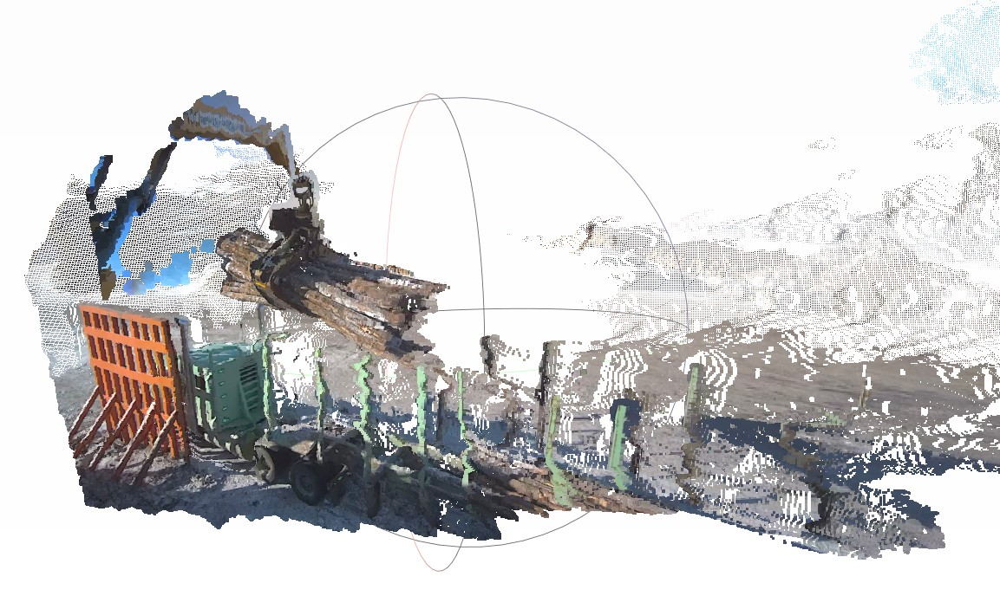

# 👀 Stereo Matching And Point Cloud Generation Using OpenCV SBGM

A simple stereo matching example with sample images and runnable code.


## 🚀 Quick Start

```bash
# Clone the repo
git clone https://github.com/yingtongL1023/OpenCV-SGBM-Stereo-Matching.git
cd OpenCV-SGBM-Stereo-Matching

# Install dependencies
pip install -r requirements.txt

# Run the demo
python opencv_stereo_pcd_gen.py

```

## 📷 Example Output
Real image group 1 is used to generate a point cloud. Output as below:

<p align="center">
  
  <br>
  <em>Figure 1. Sample point cloud generated from image group 1</em>
</p>
